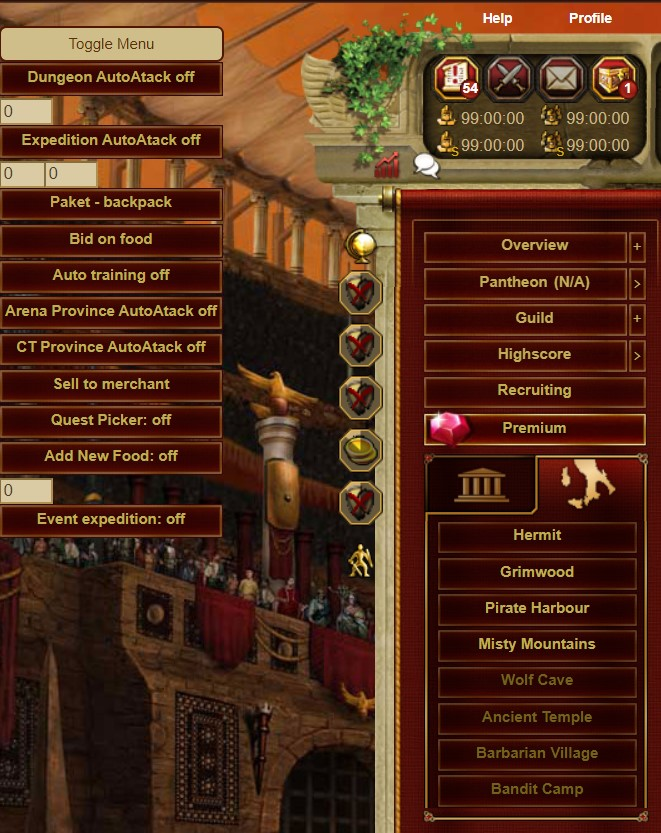

# gBot Browser Extension

 
  <h3 align="center">gBot</h3>

  

    Automation script to cover most things inside Gladiatus
    
  # Must Read :no_entry_sign:
  
  These tool is developed to demonstrate how someone can develop script to break our web application by automating stuffs and only for learning purpose.
  
   Gameforge might ban from using their game for using this tool. Use of tools like this to gain advantage over other players is not ethically right. This tool is deprecated and might need some fixes to work again.
   
   Use this tool at your own risk, any developers contributing to this repo won’t held responsibility if your account gets banned.
  

<!-- TABLE OF CONTENTS -->

## Table of Contents

- [Installation](#installation)
- [How to use](#How to use)

<!-- installation -->

## Installation

1. Open Google Chrome
2. Click on the Extensions icon
3. In new pop-up, click on the Manage Extension link
4. On the top-right screen, turn on the Developer Mode
5. Click on the Load unpacked button
6. Select this script zipped from your computer

<!-- how to ue -->

## How to use

1. Dungeon Auto Attack Options: 0 - No, 1 - Yes
2. Expedition Auto Attack: From 0 to 3 where 0 is the first enemy in a current expedition
3. Paket-backpack will pack all items in your inventory using your guild market
4. Bid on food will bid on all food that has no current bids
5. Arena Province Autoattack on/off 
6. CT Province AutoAttack on/off
7. Sell to merchant option will sell all items on the current page to some merchant
8. Quest picker on/off will accept quests for arena and CT and re-pick them if they fail to
9. Add new food: on/off will take food from your backpack and store it on the first page of the inventory
10. Event expedition from 0 to 3 where 0 is the first enemy in a current event
